# PushBox 美术文档

## 1. 打开编辑器
### 1.1 从UE顶栏菜单中打开编辑器

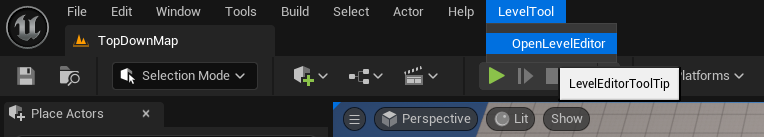

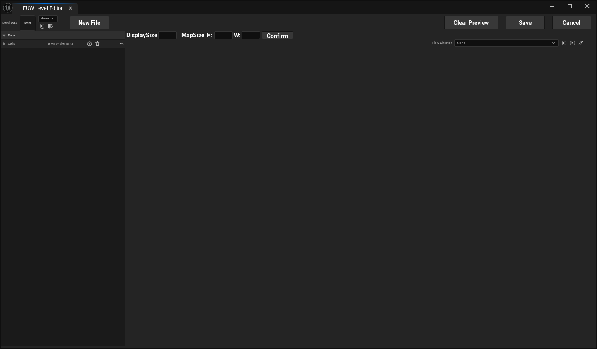

### 1.2 获取关卡数据
1. 选中场地中放置的BP_PushBoxFlowDirector
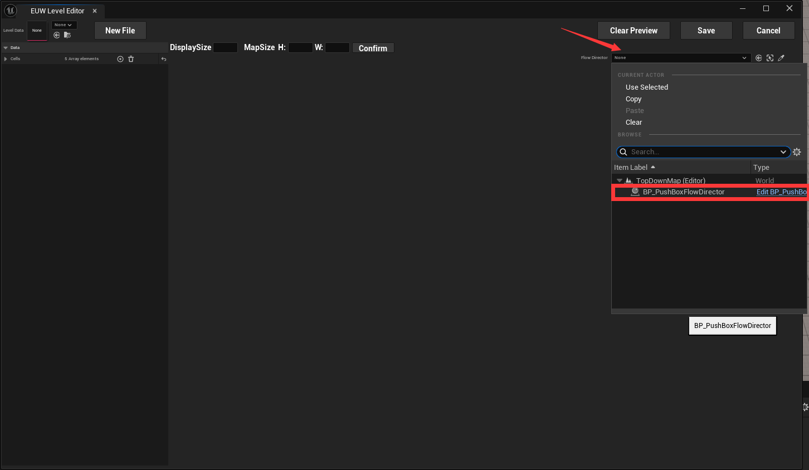
2. 之后会看到对应的关卡流程信息
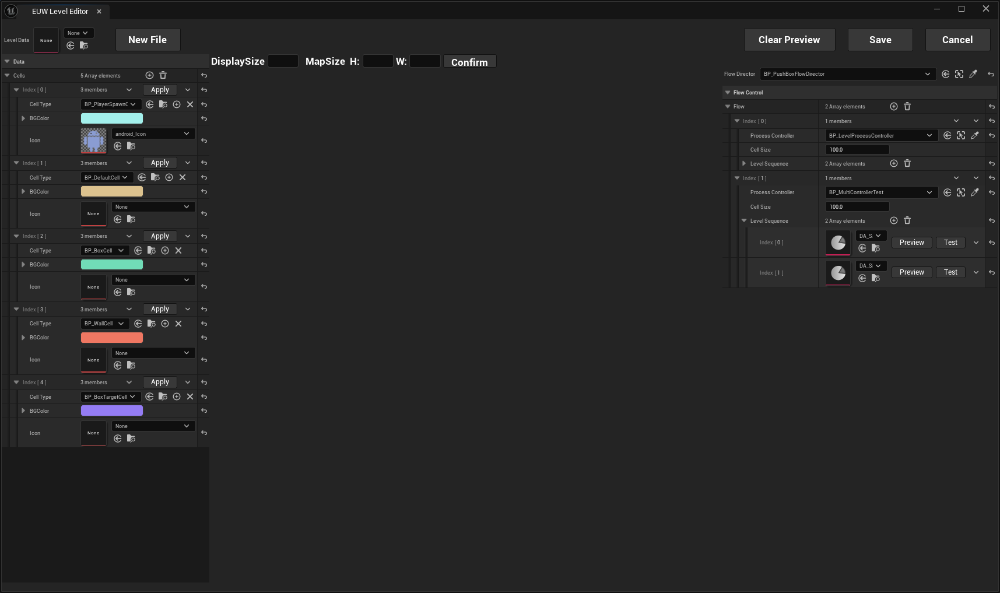
3. 打开配置在流程中的关卡
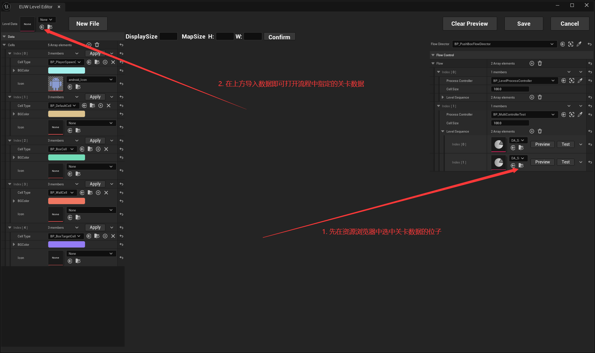
4. CellList中可以看到地图中使用的格子的对应资源，通过跳转访问这些资源可以编辑其美术资产
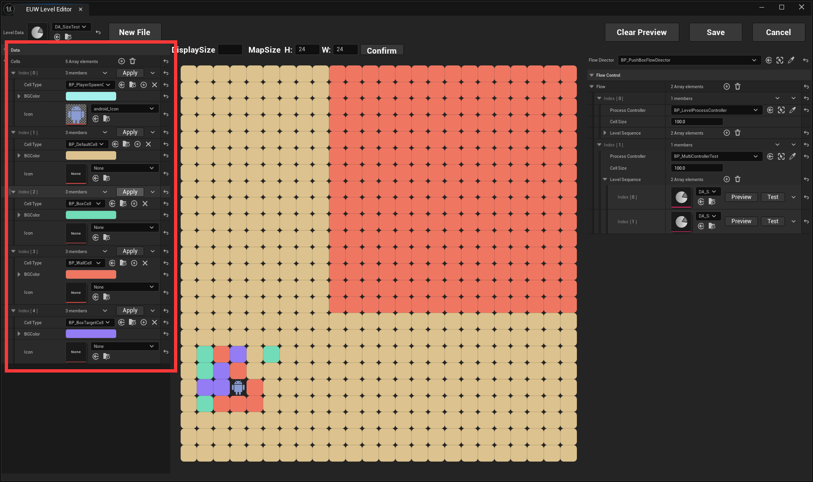
5. 通常的Cell中只有一个Niagara和一个StaticMesh，但是下列资源会有额外的资源需要配置
#### BoxCell
- BoxCell中会有绑定的BoxActor，里面也有美术资源需要配置
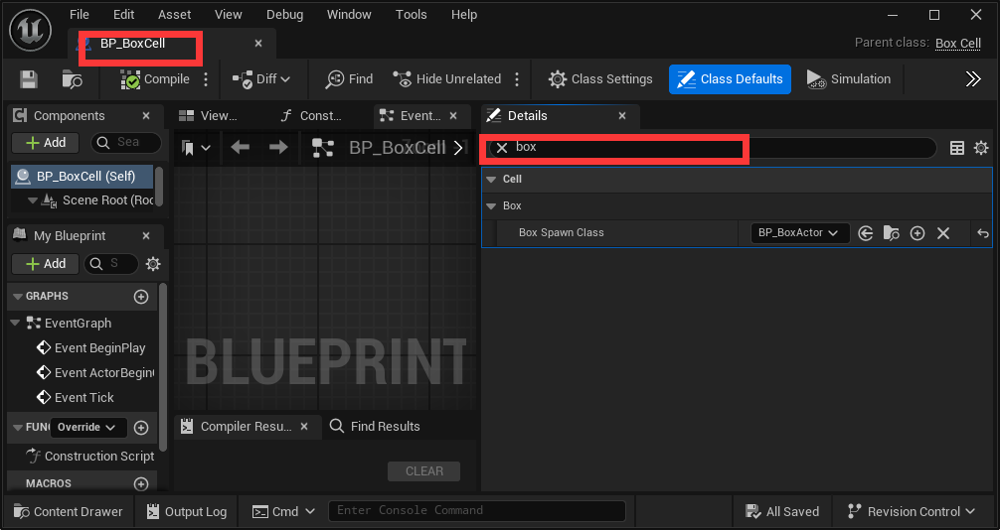
#### TargetCell
- TargetCell中不仅有默认的Niagara，还有一个完成后会显示的Niagara需要配置
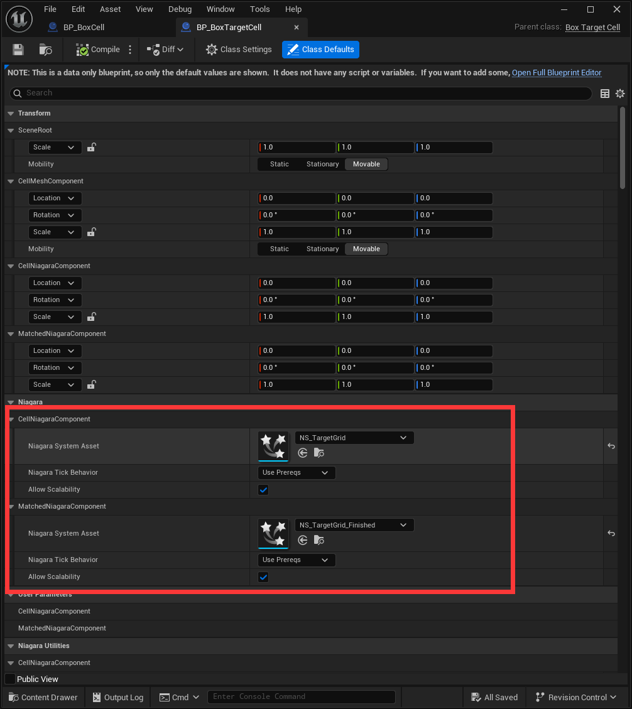
#### PlayerSpawnCell
- 生成的玩家角色使用的是Gamemode里面的pawn
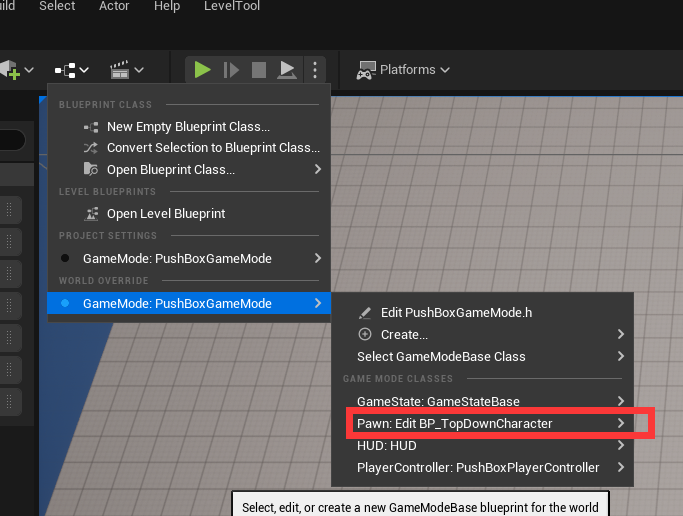

### 1.3 预览关卡
- 配置好资产之后，可以按预览关卡查看其在实际地图中的摆放效果，可以通过CellSize控制每个格子的大小。
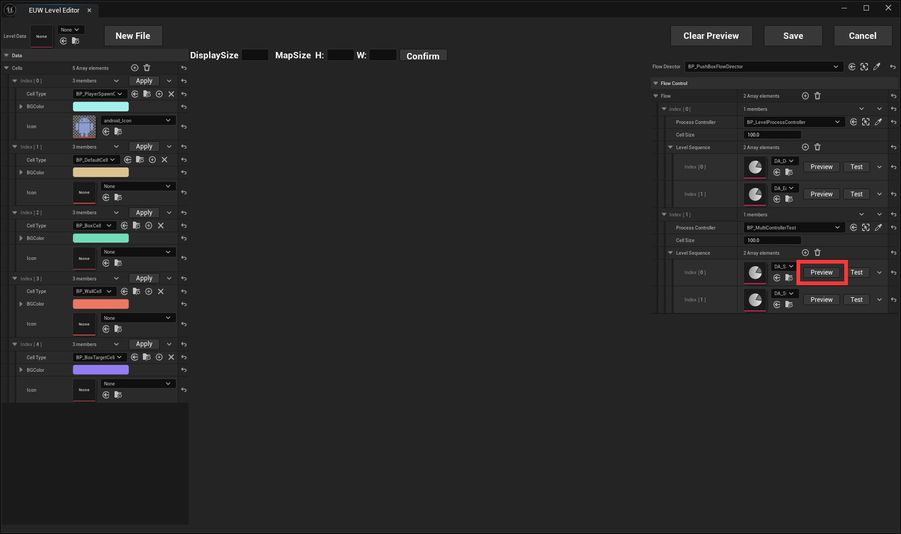
- 可以通过移动场地中对应ProcessController的位置移动预览的关卡位置。点击关卡编辑器中的ClearPreview可以清除预览。
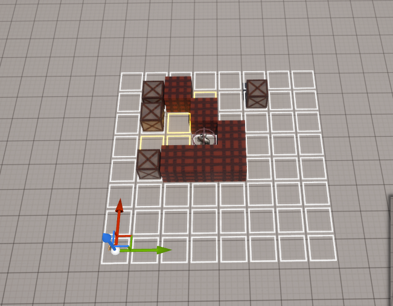

## 2. UI
- UI资产可以在如下位置配置

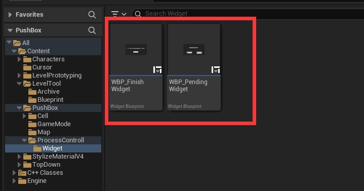