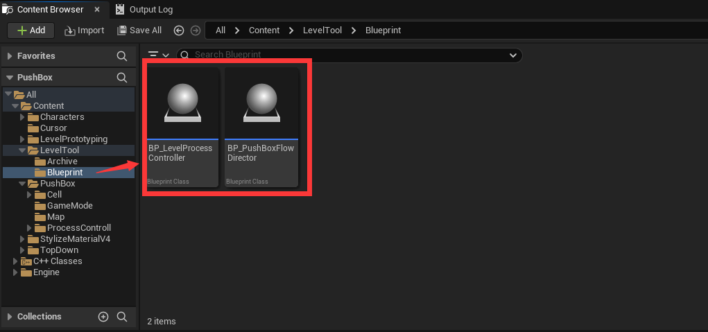
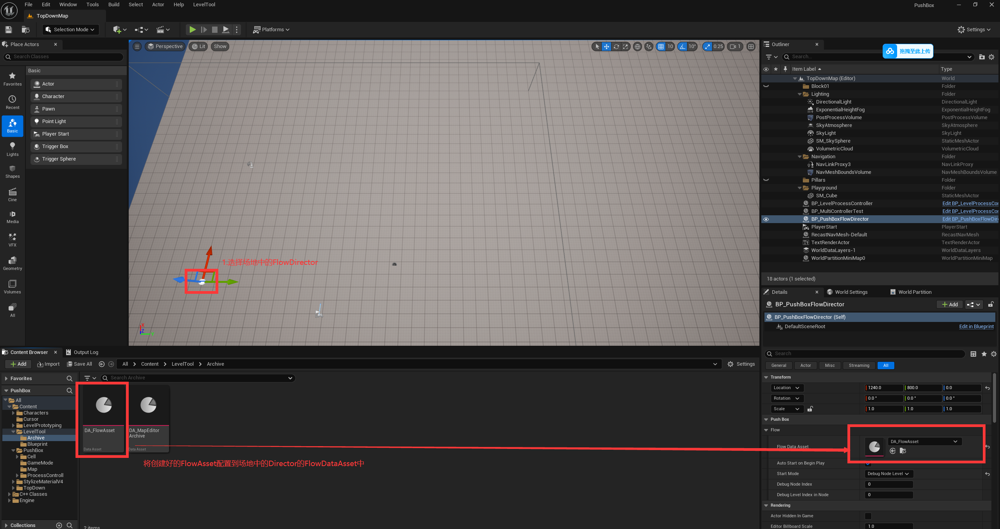
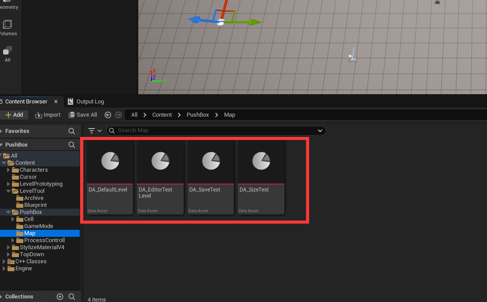
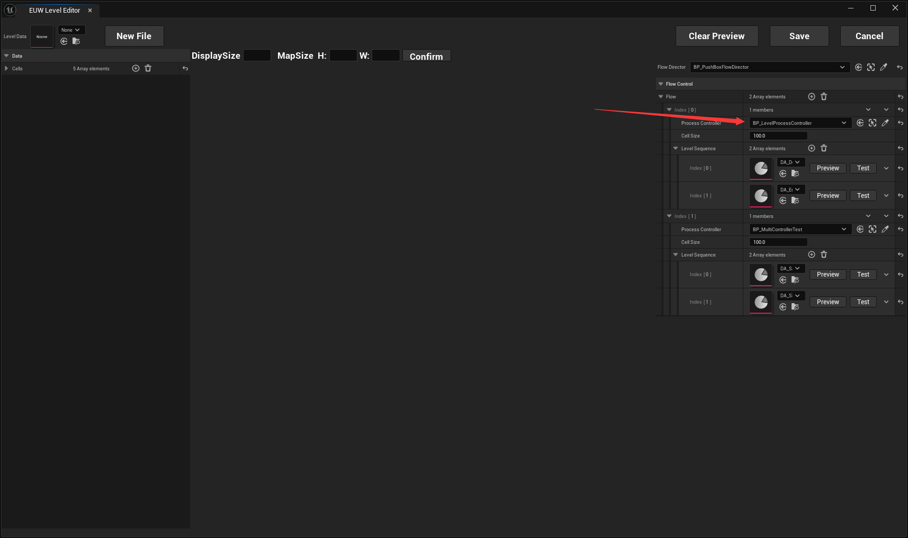

# PushBox 策划使用文档

> 本文档以“怎么配、怎么用、怎么测”为主。

## 1. 日常工作流

1. 选择要编辑的 `LevelData` 资产。
2. 在地图编辑器里完成布局（选择 -> Apply / 复制粘贴）。
3. 点击保存回写到目标 `LevelData`。
4. 在 Flow 中把关卡挂到目标 `ProcessController` 的 `LevelSequence`。
5. 使用 `Preview` / `Test` 验证，再进入 PIE 跑完整流程。

## 2. 流程配置（FlowDirector + ProcessController）

### 2.1 你需要配置的对象

- 地图中摆放：`BP_LevelProcessController`（可多个）。
- 流程入口：`BP_PushBoxFlowDirector`。
- 流程数据：`DA_FlowAsset`（或你的 FlowDataAsset）。

### 2.2 配置步骤
#### 2.2.1 打开编辑器
1. 从UE顶栏菜单中打开编辑器

#### 2.2.2 地图编辑
1. 地图数据文件
可以直接在UE中创建地图资产，也可以直接通过编辑器中的NewFile+Save进行创建

2. 编辑器具体使用方法
见[地图编辑器操作手册](/design.md/#3-地图编辑器操作手册)

#### 2.2.3 游戏关卡流程编辑
1. 选中场地中放置的BP_PushBoxFlowDirector

2. 选择FlowDirector之后会获取其下的FlowAsset

通过将场景中的BP_LevelProcessController配置到其中，然后配置该控制器下每个关卡的LevelDataAsset。
3. 编辑流程中的关卡

- 举例说明：利用UE自带的查看文件位置，和用选中的文件设置属性的功能，可以直接进入Flow中某个LevelData的编辑，反过来也可以将编辑中的LevelData设置到流程中。

**BP_LevelProcessController用于控制关卡在地图中的生成位置**
**配置完成后，点击编辑器中对应地图的Test，将从该选中的地图开始向下进行，点击UE自带的调试按钮则会从头开始进行**
**如果Test时出现卡顿，可以尝试将地图编辑器最小化**
**如果编辑器中编辑Flow列表有多个指向同一个具体场景中ProcessController的Node时，Test只会进入处于上方的流程**

## 3. 地图编辑器操作手册

### 3.1 选择与刷格
- 普通点击/框选：替换当前选择。
- `Shift` + 点击/框选：追加选择。
- `Ctrl` + 点击/框选：从已选中移除。
- 在 `Cells` 列表选择条目后点 `Apply`，批量覆盖当前选区。

### 3.2 复制粘贴
- `Ctrl+C`：复制当前选区并进入粘贴预览。
- 鼠标悬浮：显示将要粘贴的图案预览。
- 左键：执行粘贴（连续盖章，不自动退出）。
- `Q / E`：旋转预览图案。
- `Esc`：退出粘贴模式。
- 越界区域会自动裁剪，不会越界写入。

### 3.3 撤回与重做
- `Ctrl+Z`：撤回
- `Ctrl+Y`：前进
- 需先点击地图区域，让焦点在 MapEditor 上。

## 4. 测试方式

### 4.1 Preview（布局预览）
- 在 Flow 右侧每个关卡项点 `Preview`。
- 用于看关卡布局与位置，不走完整流程状态机。
- `Clear Preview` 清除当前预览对象。

### 4.2 Test（快速开测）
- 在关卡项点 `Test`，可快速进入测试入口。
- 适合验证某个流程节点/关卡是否可玩。

### 4.3 PIE 全流程
- 用编辑器 Play 跑遍完整流程

## 5. 常见问题排查

- **点击没反应**：先点地图使 MapEditor 获得焦点。
- **Next 不跳关**：检查 FlowData 的 Node 顺序与每个 LevelSequence 是否为空。
- **Preview 残留**：使用 `Clear Preview` 清理后再重新预览。
- **粘贴形状不对**：确认当前是否仍处于粘贴模式，必要时按 `Esc` 退出后重试。

## 6. 交付前策划自检清单

- 每个流程节点至少有 1 个有效关卡。
- 关键关卡可通过 Test 直接启动。
- 全流程至少跑通一次（首关 -> 末关）。
- 地图编辑器保存后重开工程数据不丢失。
